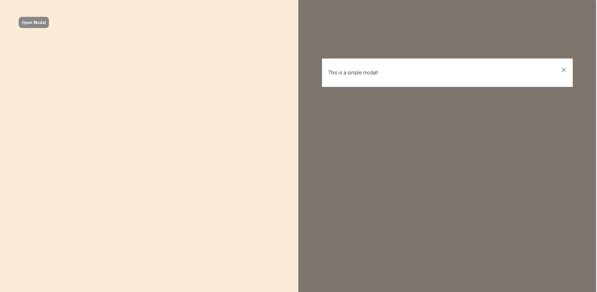

# JavaScript Modal Component

A simple and responsive modal component built with **HTML**, **CSS**, and **JavaScript**.

## Preview

<p align="center">
  
</p>

## Features

* Open the modal by clicking the button
* Close the modal using the close (`×`) button
* Close the modal by clicking outside the modal
* Sliding animation from the right
* Responsive and clean user interface

## Technologies Used

* HTML5
* CSS3
* JavaScript (ES6)

## Project Structure

```text
javascript-modal/
│── index.html
│── styles.css
│── README.md
└── images/
    └── modal-preview.png
```

## How to Run

1. Clone or download this repository.
2. Open `index.html` in your browser.

## Learning Purpose

This project was built as part of my JavaScript learning journey. It focuses on practicing:

* DOM Manipulation
* Event Handling
* CSS Positioning
* Basic Animation
* User Interaction

## Future Improvements

* Close the modal with the `Escape` key
* Add smooth CSS transitions
* Improve accessibility (ARIA attributes)
* Prevent background scrolling while the modal is open

## Author

Created by **Setareh Kazemi**
